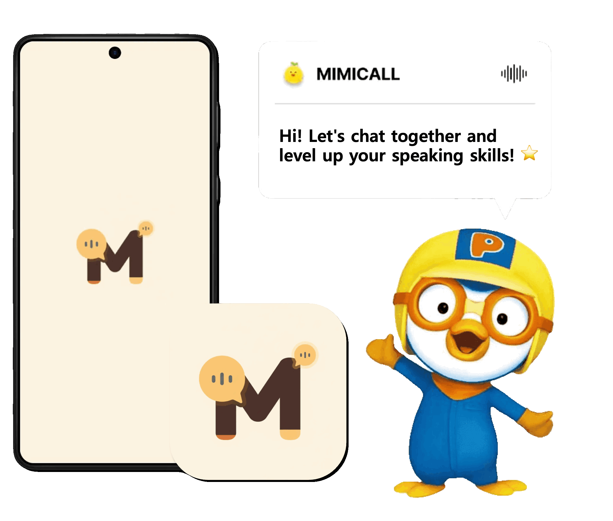
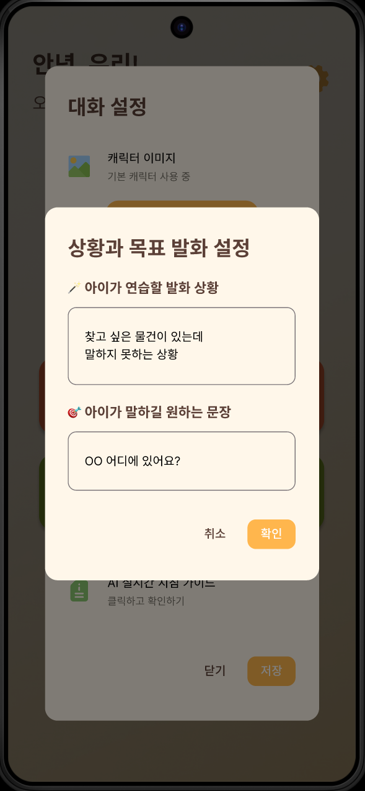
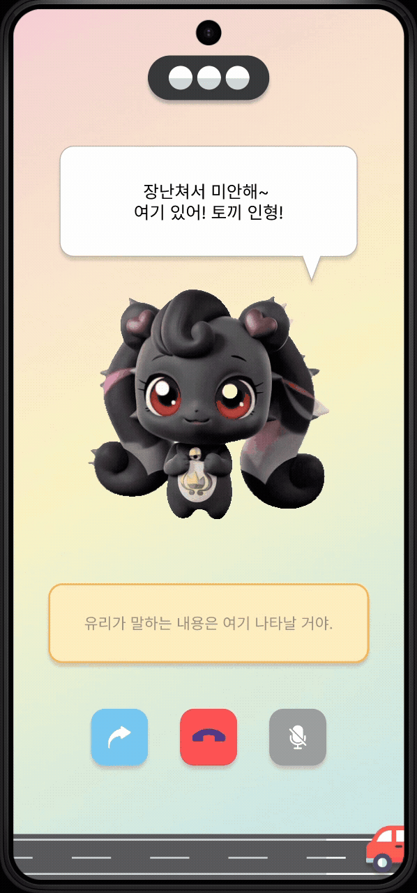
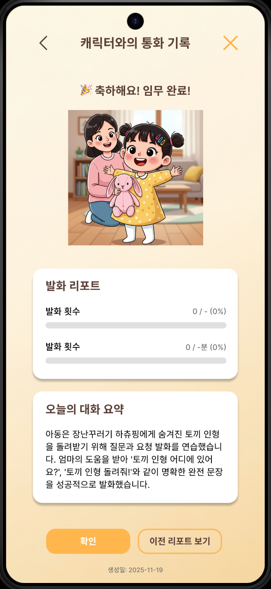
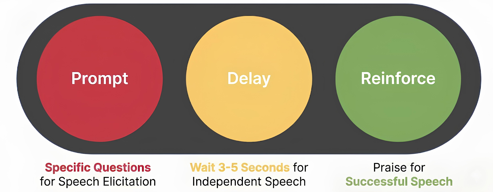

# Mimicall ☎️

  

<h3 align="center">AI Call Service for Children with Language Development Delay</h3>

**Mimicall** is an AI-assisted language therapy prototype that helps children practice speech by talking with AI-generated characters.  
Parents can set conversation topics, target sentences, and character voices, while the system generates real-time interactive conversations and reports.

---

## Service Overview & Features

**"Encourages children to repeat words without resistance through interactive video calls with their favorite characters."**

- **Name Origin**: **Mimicall** = MIMIC (to imitate) + CALL
- **Core Keywords**:
  - **Fun**: Speech practice that feels like play, not studying.
  - **Interaction**: Two-way, engaging interaction with favorite characters.
  - **Growth**: Language skill improvement through spontaneous and voluntary utterances.

### 1. Main Service Flow

  | Step 1: Prompt Input | Step 2: Traffic Light Guidelines | Step 3: Visual Feedback | Step 4: Report Generation |
  | :---: | :---: | :---: | :---: |
  |  |  |  |  |

The service is designed with a 4-step process to effectively help children practice speech:
1. **Conversation Prompt Input**: Parents can configure the target utterance and specific situations they want their child to practice.
2. **Problem-Solving & Traffic Light Guidelines**: The AI presents step-by-step problem situations to induce the target utterance. Real-time "Traffic Light" color-coded guidelines are provided on the screen to coach parents on how to assist.
3. **Problem-Solving Visualization**: Visual feedback is provided on-screen when the child successfully solves the problem during the AI call, keeping them engaged.
4. **Report Generation**: After the session, a detailed conversation report and progress summary are automatically generated.

### 2. Traffic Light Guidelines (Milieu Teaching Technique)

Mimicall applies the **Milieu Teaching** technique to encourage natural language development. This system is designed to prevent parents' excessive intervention and the habit of speaking for the child, which can hinder language growth. The color-coding reduces the cognitive burden on parents during the call.

- 🔴 **Prompt**: Ask specific questions to induce the child's utterance.
- 🟡 **Delay**: Wait 3 to 5 seconds to give the child time to speak on their own.
- 🟢 **Reinforce**: Provide praise and positive reinforcement for the child's successful utterance.

### 3. Key Technical Features

- AI conversation system for child speech practice
- Voice cloning for personalized character voices
- Automatic STT (speech-to-text) and TTS (text-to-speech)
- Conversation report generation and progress tracking
- Cloud-based backend with Firebase and serverless functions

---

## Tech Stack

| Layer | Technology |
|--------|-------------|
| **Frontend** | Flutter |
| **Backend** | Node.js (Firebase Functions) |
| **Database / Storage** | Firebase Realtime Database, Firebase Storage |
| **AI / APIs** | OpenAI (GPT-4o, Whisper, DALL·E 3), ElevenLabs (TTS, Voice Cloning), GoEnhance (Image-to-Video) |
| **Version Control** | GitHub |

---

## System Architecture

*Figure 1. Mimicall service architecture*

---

## App Structure

**Screens**
- `name_landing_screen.dart` – user entry / name input
- `main_screen.dart` – main dashboard
- `incoming_call_screen.dart` – incoming call screen
- `in_call_screen.dart` – live call (character conversation)
- `report_list_screen.dart`, `report_screen.dart` – conversation report list and details

**Widgets**
- Modular UI components for reuse
- Examples: `chat_bubble.dart`, `app_header.dart`, `character_settings.dart`, `report_summary_box.dart`

---

## Backend Overview

- **Realtime Database:** user data and conversation storage
- **Cloud Functions:** voice cloning and AI response generation
- **Storage:** user-uploaded voice files for character cloning

---

## APIs

| API | Purpose |
|------|----------|
| **OpenAI** | GPT-4o for dialogue, Whisper for STT, DALL·E 3 for visual summaries |
| **ElevenLabs** | Voice cloning and text-to-speech |
| **GoEnhance** | Image-to-video animation for character motion |
